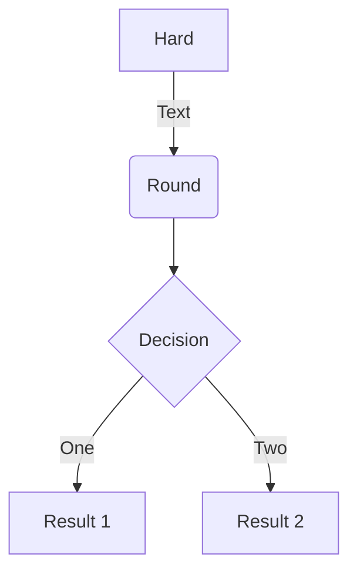
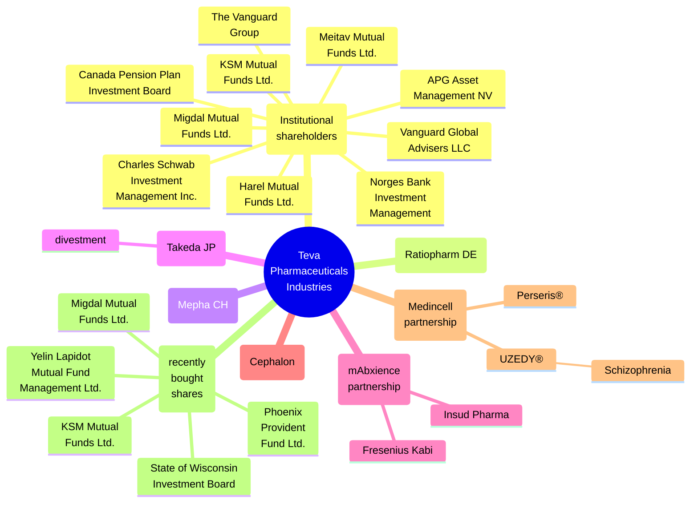
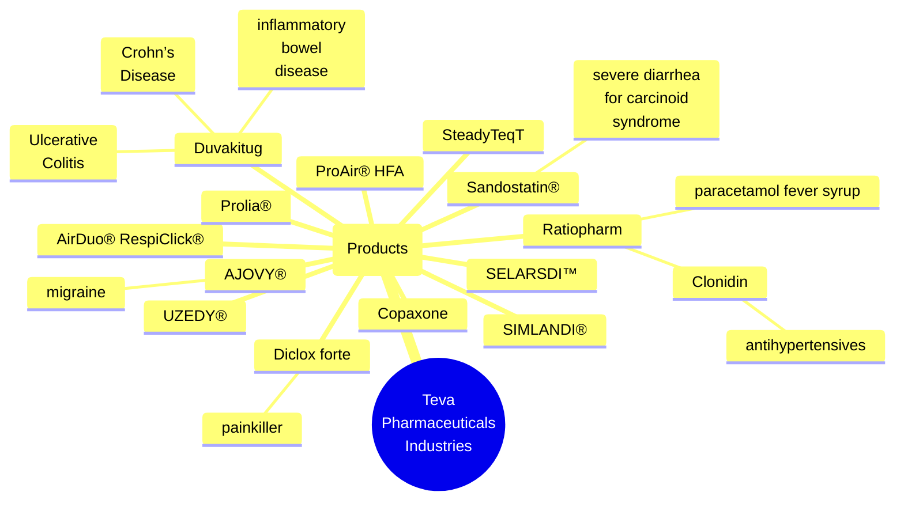
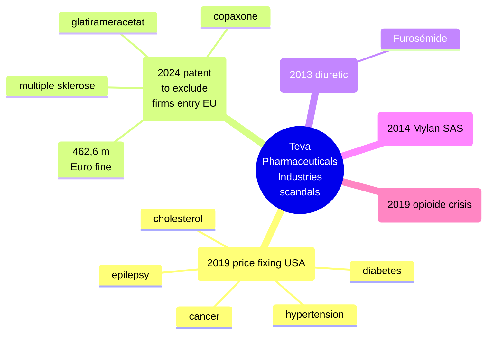

Teva specializes primarily in generic drugs, but other business interests include branded-drugs, active pharmaceutical ingredients (APIs) and, to a lesser extent, contract manufacturing services and an out-licensing platform.

In 2010, Teva acquired the German pharmaceutical company **Ratiopharm**.

## Institutional shareholders and partnerships

## Products

## Scandals

